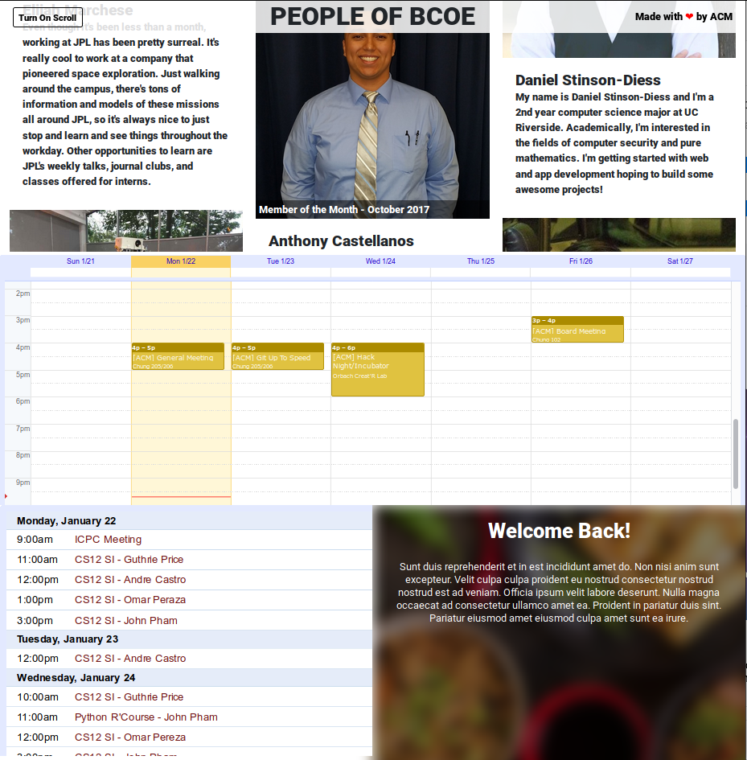

# ACM Billboard

> A display board used in the ACM clubroom

This is the code for the ACM Billboard, a web app that will run on a TV in the ACM Clubroom. The purpose of the TV is to, at a glance, provide some context as to what's happening with ACM that week! We're also using this to feature some of our most active members.



As you can see, there are four main sections:

* **People of BCOE (Bourns College of Engineering)**: This area is used to feature our prominent members. The pictures are pulled from Facebook or per member request. The blurbs are excerpts from blog posts that we've written about them, highlighting their awesome work in the community.
* **Weekly Calendar**: This calendar view is to quickly glance at the times for meetings/events that we're holding throughout the week.
* **Daily Calendar**: This calendar view has more data for the actual event, and can be viewed for specific rooms and times.
* **Announcements**: This bottom-right section is meant for topical announcements, either a highly marketed event (i.e. a career fair, a hackathon, certain workshops, etc.). If the room is currently being used, the announcement section will clearly display what is going on in the room.

If you'd like to contribute to the project, read on to the Development section!

## Development

### Build Setup

```bash
# install dependencies
npm install

# serve with hot reload at localhost:8080
npm run dev

# build for production with minification
npm run build

# build for production and view the bundle analyzer report
npm run build --report
```

For a detailed explanation on how things work, check out the [guide](http://vuejs-templates.github.io/webpack/) and [docs for vue-loader](http://vuejs.github.io/vue-loader).
